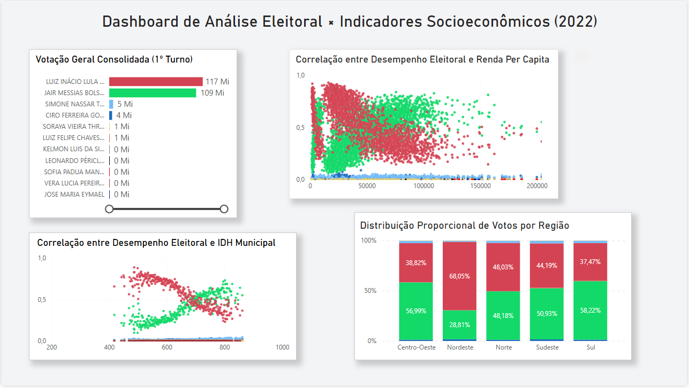

## 💡 Principais Insights e Descobertas

Através dos gráficos de dispersão e análise de proporção, o modelo revelou padrões claros de comportamento eleitoral:

### 1. Correlação entre IDH / Renda e Preferência Eleitoral
* **Segmentação Socioeconômica:** A análise de dispersão demonstrou uma clara polarização atrelada à renda e ao Índice de Desenvolvimento Humano. Municípios com faixas menores de IDH e menor Renda Per Capita apresentaram uma forte concentração percentual de votos no candidato Luiz Inácio Lula da Silva (representado em vermelho).
* **Inversão de Tendência:** Em contrapartida, à medida que o IDH municipal e a Renda Per Capita avançam nos eixos, os gráficos de dispersão mostram uma curva ascendente para o candidato Jair Messias Bolsonaro (representado em verde), evidenciando que cidades com melhores indicadores socioeconômicos tenderam a concentrar seus votos neste candidato.

### 2. Distribuição Geográfica e Comportamento Regional
O dashboard confirmou visualmente as disparidades regionais do país no pleito de 2022, com destaque para comportamentos atípicos e equilíbrios:
* **A Exceção do Nordeste:** A região Nordeste foi o maior ponto de desvio da média nacional, apresentando uma vantagem expressiva de **68,05%** dos votos para Lula, contra apenas **28,81%** de Bolsonaro.
* **Zonas de Equilíbrio:** As regiões Norte e Sudeste apresentaram o cenário de maior disputa, com uma divisão de votos extremamente equilibrada (ex: Norte com 48,03% vs. 48,18%).
* **Vantagem Sul e Centro-Oeste:** As regiões Sul e Centro-Oeste consolidaram uma ligeira vantagem para o candidato Bolsonaro, atingindo **58,22%** e **56,99%** da preferência válida, respectivamente.

---

## 📁 Estrutura do Repositório

| Arquivo/Pasta | Descrição |
| :--- | :--- |
| `analise_votos_presidente_2022_idh_municipio.ipynb` | Notebook Python contendo todo o código de limpeza e cruzamento de dados via Pandas. |
| `fato_votacao_socioeconomica_2022.csv` | Dataset final consolidado e tratado, pronto para consumo em ferramentas de BI. |
| `analise_eleitoral.pbix` | Arquivo do Power BI com o modelo de dados, medidas DAX e o dashboard interativo. |

---

## 📸 Preview do Dashboard

*(Visualizações focadas em correlação de dados e distribuição proporcional)*

 

---

## 🌐 Fontes dos Dados (Data Sources)

Devido ao grande volume de dados e ao tamanho dos arquivos originais extraídos do Censo e do TSE, as bases brutas não foram incluídas neste repositório para manter a performance do ambiente. O pipeline de dados consome diretamente os dados públicos das seguintes fontes oficiais:

*   **Resultados da Votação (TSE):** Dados estatísticos de votação por município e zona eleitoral referentes ao 1º Turno das Eleições Gerais de 2022, obtidos através do Portal de Dados Abertos do [Tribunal Superior Eleitoral (TSE)](https://dadosabertos.tse.jus.br/).
*   **Indicadores Socioeconômicos (IBGE / PNUD):** Dados do Índice de Desenvolvimento Humano Municipal (IDHM) e Renda Per Capita baseados nas tabelas oficiais do [Instituto Brasileiro de Geografia e Estatística (IBGE)](https://www.ibge.gov.br/) e do Censo Demográfico.

---

👨‍💻 **Desenvolvido por Patrick Carvalho** *Focado na transformação de dados complexos em soluções visuais estratégicas.*

